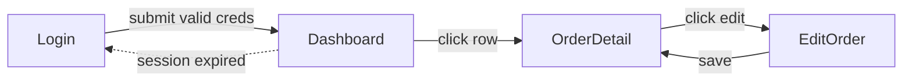
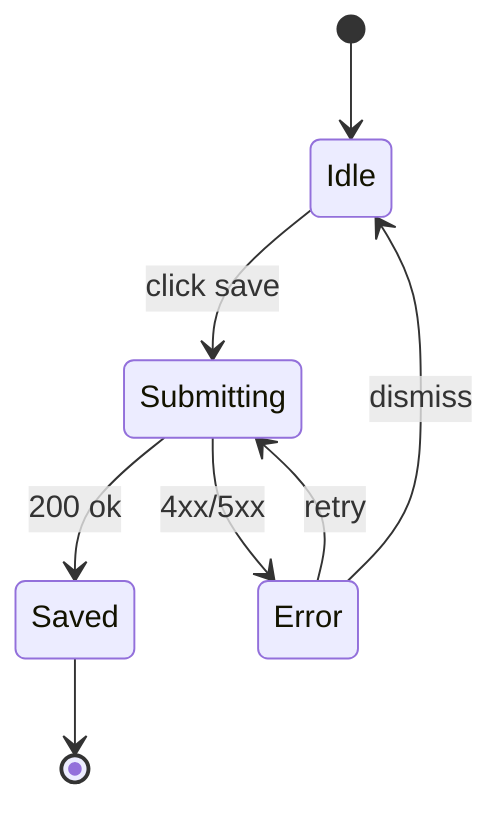

This skill will be invoked when the user wants to create a PRD. You may skip steps if you don't consider them necessary.

1. Ask the user for a long, detailed description of the problem they want to solve and any potential ideas for solutions.

2. Explore the repo to verify their assertions and understand the current state of the codebase.

3. Pressure-test the plan with `grill-me` (engineer framing) or `interview-me` (non-technical client framing). Pick by scanning the user's Step 1 description:

   - Use **`grill-me`** if the description contains ≥2 technical terms (API, endpoint, schema, table, column, queue, cache, race, idempotency, transaction, migration, deploy, refactor, module, component, hook, lambda, container, type, interface, library/framework names).
   - Use **`interview-me`** if the description is dominated by domain/business language (customer, order, invoice, vendor, staff, refund, policy, regulation, workflow, approval) with no implementation detail.
   - **Mixed or unclear** → ask once: "Should I grill you engineer-to-engineer (technical decisions, jargon OK) or interview you in plain business terms?" Single AskUserQuestion with two options. Default to `grill-me` if the user skips.

   Walk every branch until decisions are Resolved or Deferred. Open questions must be resolved before writing the PRD.

   **Skip the interview** if the user already says "I just ran /grill-me" or "/interview-me" and pastes a Resolved Plan — proceed to Step 4 with that as the input.

3.5. **Detect whether this PRD involves UI changes, and if so, draft ASCII wireframes.**

After completing the interview, scan the notes and conversation for these signals:

**Triggers UI wireframe flow (any one is sufficient):**
- A new page or screen will be created
- An existing page or screen will be visually modified
- A new UI component, form, dialog, modal, or dashboard element will be added
- The user explicitly mentions "design", "layout", "looks like", or "UI"

**Skip UI wireframe flow (all of these apply):**
- The change is API-only (new endpoint, changed contract, no frontend consumer)
- The change is schema/migration-only
- The change is an internal background job, worker, or CLI tool
- The change is CI, infra, or config only

**If ambiguous**, use AskUserQuestion:
- Question: "Does this PRD involve any changes to the UI (new pages, modified screens, new components)?"
- Options: "Yes — includes UI changes" / "No — backend/API only"

**If UI is involved — generate ASCII wireframes:**

**Step A: Enumerate screens and states.**

Before drawing, ask the user once:
- Viewport: "Mobile, desktop, or both?" (AskUserQuestion: "Mobile only" / "Desktop only" / "Both — draw separate wireframes")
- For each screen, enumerate which of these states apply: **default / empty / loading / error / over-limit / auth-locked / disabled-input**. Draw one wireframe per `(screen, state)` that is meaningfully different. Skip states that collapse into the default (e.g., a screen with no async data has no "loading").

Define a stable **Screen ID** per screen — short PascalCase token (e.g. `Dashboard`, `OrderDetail`, `EditProfile`). This same ID MUST appear as: the `### Screen: <ID>` heading, every Mermaid `flowchart` node, and every `stateDiagram-v2` reference. Do not drift.

**Step B: Draw the wireframes.**

Conventions (apply to every wireframe):
- **Width**: 60 chars. Mobile wireframes: 40 chars. Pad short rows; do not exceed width.
- **Box drawing**: outer frame `┌─┐│└┘├┤`. Inner separators `├──┤`.
- **Element annotation**:
  - Buttons: `[ Label ]`
  - Primary buttons: `[[ Label ]]`
  - Inputs: `[__________]` (placeholder name inside underscores OK: `[_email____]`)
  - Dropdowns: `[ Label ▼ ]`
  - Checkboxes: `[ ]` unchecked, `[x]` checked
  - Links: `<Label>`
  - Image/avatar: `(img)` or `(avatar)`
  - Auth-required marker: prefix Screen ID heading with `🔒` (e.g. `### Screen: 🔒 Dashboard`)
- **Text labels**: write raw English. Add `i18n: <key>` suffix on the same line for any label that needs translation, e.g. `[ Save ]    i18n: orders.actionSave`. Wireframe-only static labels (e.g. `[Logo]`) need no key.
- **Fallback**: If a screen is too visually complex for ASCII (data-viz canvas, drag-drop, complex tables with > 8 columns), replace the wireframe with a `<screen-prose>` block describing layout zones in plain English. Note the limitation; do not force ASCII.

**Step C: Approval loop (max 3 rounds).**

1. Present all wireframes to the user with AskUserQuestion:
   - Question: "Do these wireframes look right?"
   - Options: "Looks good — proceed" / "Needs changes"
2. If "Needs changes": ask what to fix, revise, loop.
3. After 3 revision rounds without approval, ask once: "Commit current wireframes and move on, defer UI to a later PRD, or keep iterating?" Default: commit.

**Step D: Audit (optional but recommended).**

After approval, ask: "Run /audit on the wireframes to check for missing states / ambiguous rules?" (default: yes for any feature with > 2 screens). If yes, invoke `/audit` skill against the wireframe set. Address findings, then re-confirm approval.

**Step E: Record outputs.**

Record:
- The final wireframe set (verbatim, embedded into `## UI Screens`).
- Screen IDs list (used to populate `## Screen Flow` Mermaid nodes in Step 5).
- Whether any screen has multi-step flow / async / retry / optimistic updates / wizard steps. If **any** screen does, populate `## State Flow` in Step 5; otherwise omit it.

No external tools, no Gist, no `/design` invocation. All content lives in the PRD issue body.

**If UI is NOT involved:** skip this step entirely and proceed to Step 4.

4. Sketch out the major modules you will need to build or modify to complete the implementation. Actively look for opportunities to extract deep modules that can be tested in isolation.

A deep module (as opposed to a shallow module) is one which encapsulates a lot of functionality in a simple, testable interface which rarely changes.

Check with the user that these modules match their expectations. Check with the user which modules they want tests written for.

If any modules involve API calls from the frontend, enumerate the endpoints those modules call. Discover the project's error-string convention (e.g. Express `res.status(...).json({ error: '...' })`, FastAPI `HTTPException`, Rails `render json: { error }, status: ...`) by reading 1–2 existing route files; if no convention found, ask the user. Then collect every distinct error string returned by the touched endpoints. For each error string, agree with the user on:
- A user-friendly English message
- A translation in each project locale (the project's `i18n/*.json` files reveal which locales)
- An i18n key name (camelCase, nested under the feature's own i18n section — e.g., `buildings.nameTaken`, never a shared `errors.*` namespace)

Document these agreements before writing the PRD.

5. Once you have a complete understanding of the problem and solution, use the template below to write the PRD body. If wireframes were created in Step 3.5, embed them in the `## UI Screens` section and populate the `## Screen Flow` Mermaid block. If the feature has complex state transitions (loading/error/wizard steps/optimistic updates), also populate `## State Flow`. If no UI was involved, omit all three sections entirely.

**Preview before creating.** Render the full PRD body to the user and ask for approval (use AskUserQuestion: "Looks good — create issue" / "Needs edits"). Iterate on edits until approved. Only then proceed to create the GitHub issue.

**Preflight check** the GitHub CLI before creating:

```bash
gh auth status >/dev/null 2>&1 || { echo "gh CLI not authenticated — run 'gh auth login' first"; exit 1; }
git rev-parse --is-inside-work-tree >/dev/null 2>&1 || { echo "Not in a git repo with a GitHub remote"; exit 1; }
```

If either check fails, surface the failure to the user and stop — do not attempt creation.

Ensure the "PRD" label exists, then create the issue:

```bash
gh label create "PRD" --color 8B5CF6 --description "Product Requirements Document" 2>/dev/null || true
gh issue create --title "<title>" --label "PRD" --body "..."
```

<prd-template>

## Problem Statement

The problem that the user is facing, from the user's perspective.

## Solution

The solution to the problem, from the user's perspective.

<!-- CONDITIONAL: Only include the following three sections if wireframes were generated in Step 3.5. Omit entirely for non-UI PRDs. -->

## UI Screens

<!-- One ASCII wireframe per distinct (screen, state) pair from Step 3.5.
     Heading = Screen ID. Same ID appears in Screen Flow and State Flow nodes.
     Auth-required: prefix with 🔒. -->

### Screen: Dashboard

```
┌──────────────────────────────────────────────────────────┐
│  [Logo]                                  [ User ▼ ]      │
├──────────────────────────────────────────────────────────┤
│                                                          │
│   <Stats card>          <Chart card>                     │
│                                                          │
│   ┌────────────────────────────────────────────────┐     │
│   │  Recent Orders (table)                         │     │
│   └────────────────────────────────────────────────┘     │
│                                                          │
│   [[ New Order ]]   [ Export ]   i18n: orders.export     │
└──────────────────────────────────────────────────────────┘
```

### Screen: Dashboard — empty state

```
┌──────────────────────────────────────────────────────────┐
│  No orders yet.                                          │
│  [[ Create your first order ]]                           │
└──────────────────────────────────────────────────────────┘
```

## Screen Flow

<!-- Mermaid node IDs MUST equal Screen IDs above.
     Edges MUST be labeled with the trigger ("on submit", "click row", etc.).
     Use {{guard}} on edges that require auth or other guards. -->



<!-- CONDITIONAL: Include ## State Flow only when ≥1 screen has multi-step flow,
     async loading, retry, optimistic updates, or wizard progression.
     Omit for plain CRUD. Use one stateDiagram-v2 per stateful screen. -->

## State Flow

### EditOrder state machine



<!-- END CONDITIONAL -->

## User Stories

A LONG, numbered list of user stories. Each user story should be in the format of:

1. As an <actor>, I want a <feature>, so that <benefit>

<user-story-example>
1. As a mobile bank customer, I want to see balance on my accounts, so that I can make better informed decisions about my spending
</user-story-example>

This list of user stories should be extremely extensive and cover all aspects of the feature.

## Implementation Decisions

A list of implementation decisions that were made. This can include:

- The modules that will be built/modified
- The interfaces of those modules that will be modified
- Technical clarifications from the developer
- Architectural decisions
- Schema changes
- API contracts
- Specific interactions
- API error handling (when the feature involves frontend API calls): for each distinct backend error string returned by touched endpoints, record the mapping: error string → i18n key → friendly EN message → friendly VI message. Keys live under the feature's existing i18n section (e.g., `buildings.nameTaken`), never under a shared `errors` or `apiErrors` namespace.

Do NOT include specific file paths or code snippets. They may end up being outdated very quickly.

## Testing Decisions

A list of testing decisions that were made. Include:

- A description of what makes a good test (only test external behavior, not implementation details)
- Which modules will be tested
- Prior art for the tests (i.e. similar types of tests in the codebase)

## Out of Scope

A description of the things that are out of scope for this PRD.

## Further Notes

Any further notes about the feature.

</prd-template>
