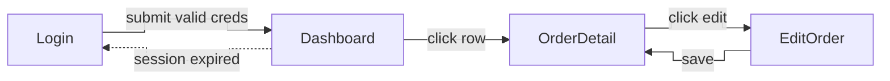
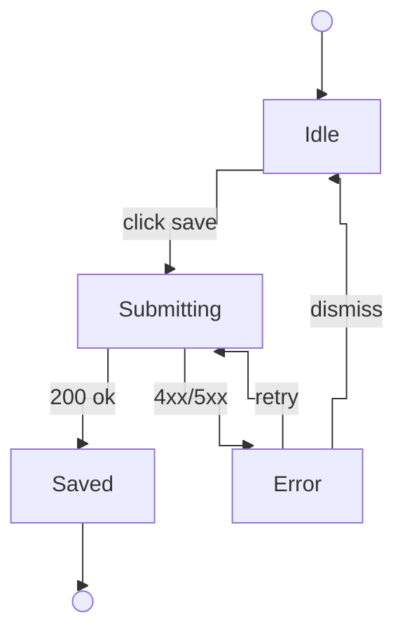

This skill will be invoked when the user wants to create a PRD. You may skip steps if you don't consider them necessary.

1. Ask the user for a long, detailed description of the problem they want to solve and any potential ideas for solutions.

2. Explore the repo to verify their assertions and understand the current state of the codebase.

3. Pressure-test the plan with `grill-me` (engineer framing) or `interview-me` (non-technical client framing). Pick by scanning the user's Step 1 description:

   - Use **`grill-me`** if the description contains ≥2 technical terms (API, endpoint, schema, table, column, queue, cache, race, idempotency, transaction, migration, deploy, refactor, module, component, hook, lambda, container, type, interface, library/framework names).
   - Use **`interview-me`** if the description is dominated by domain/business language (customer, order, invoice, vendor, staff, refund, policy, regulation, workflow, approval) with no implementation detail.
   - **Mixed or unclear** → ask once: "Should I grill you engineer-to-engineer (technical decisions, jargon OK) or interview you in plain business terms?" Single AskUserQuestion with two options. Default to `grill-me` if the user skips.

   Walk every branch until decisions are Resolved or Deferred. Open questions must be resolved before writing the PRD.

   **Skip the interview** if the user already says "I just ran /grill-me" or "/interview-me" and pastes a Resolved Plan — proceed to Step 4 with that as the input.

3.5. **Detect whether this PRD involves UI changes, and if so, render HTML mockups via `/design`.**

After completing the interview, scan the notes and conversation for these signals:

**Triggers UI flow (any one is sufficient):**
- A new page or screen will be created
- An existing page or screen will be visually modified
- A new UI component, form, dialog, modal, or dashboard element will be added
- The user explicitly mentions "design", "layout", "looks like", or "UI"

**Skip UI flow (all of these apply):**
- The change is API-only (new endpoint, changed contract, no frontend consumer)
- The change is schema/migration-only
- The change is an internal background job, worker, or CLI tool
- The change is CI, infra, or config only

**If ambiguous**, use AskUserQuestion:
- Question: "Does this PRD involve any changes to the UI (new pages, modified screens, new components)?"
- Options: "Yes — includes UI changes" / "No — backend/API only"

**If UI is involved — render HTML mockups, then capture screenshots, then upload them.**

**Step A: Enumerate screens and states.**

Before delegating, ask the user once:

- Viewport: "Mobile, desktop, or both?" (AskUserQuestion: "Mobile only" / "Desktop only" / "Both — render both viewports")
- For each screen, enumerate which of these states apply: **default / empty / loading / error / over-limit / auth-locked / disabled-input**. The states are illustrated within the same HTML mockup for that screen (side-by-side, tabbed, or with a visible state toggle). Skip states that collapse into the default (e.g., a screen with no async data has no "loading").

Define a stable **Screen ID** per screen — short PascalCase token (e.g. `Dashboard`, `OrderDetail`, `EditProfile`). This same ID MUST appear as: the `### Screen: <ID>` heading in the PRD body, every Mermaid `flowchart` node in `## Screen Flow`, and every `graph TD` state node in `## State Flow`. Do not drift. For auth-required screens, prefix the Screen ID with `🔒` in the heading (e.g. `### Screen: 🔒 Dashboard`).

**Step B: Delegate rendering to `/design` (one invocation per Screen ID).**

```bash
REPO_ROOT="$(git rev-parse --show-toplevel)"
DESIGN_DIR="$REPO_ROOT/.design"
mkdir -p "$DESIGN_DIR"
```

For each Screen ID (base PascalCase name; states are illustrated within the same HTML):

1. Compute the kebab-case slug from the Screen ID (e.g. `OrderDetail` → `order-detail`, strip the `🔒` prefix).
2. Invoke the `/design` skill with arguments `--path "$DESIGN_DIR" <screen-id-kebab>` and a brief description of the screen plus the states it must illustrate plus the chosen viewport(s).
3. `/design` runs its own Step 4–6 approval loop, captures a screenshot with playwright-cli in Step 6.5, and prints exactly one final line:

   ```
   DESIGN_APPROVED slug=<slug> html=<absolute-html-path> png=<absolute-png-path-or-NONE>
   ```

4. Parse that line and record `(screenId, slug, htmlPath, pngPath)`. Read the HTML file contents into memory for embedding into the PRD body.
5. If `png=NONE` (screenshot failed), continue but warn the user: the PRD will embed the local relative path instead of an image.

**Step C: Upload screenshots to GitHub `user-attachments` via the `gh image` extension.**

Once all screens are approved and screenshots are on disk, upload the PNGs so the PRD issue (and every `/ship-it` task issue) can render them inline.

```bash
gh extension list 2>/dev/null | grep -q "drogers0/gh-image" || \
  gh extension install drogers0/gh-image

GH_IMAGE_OK=1
gh image check-token >/dev/null 2>&1 || {
  echo "warn: gh image session token invalid; will fall back to local path embeds"
  GH_IMAGE_OK=0
}

OWNER_REPO="$(gh repo view --json nameWithOwner --jq .nameWithOwner)"
```

For each `(screenId, pngPath)` where `pngPath != NONE`:

```bash
if [ "$GH_IMAGE_OK" = "1" ]; then
  MD_LINE="$(gh image "$pngPath" --repo "$OWNER_REPO")" || MD_LINE=""
  PNG_URL="$(printf '%s\n' "$MD_LINE" | sed -E 's/.*\((https:[^)]+)\).*/\1/')"
fi
```

Notes:

- `gh image` reads the user's GitHub session cookie from the local browser cookie store (Chrome/Brave/Edge/Firefox/Safari). On macOS the first run may trigger a Keychain prompt — surface that to the user and re-run if it fails.
- Output URL is `https://github.com/user-attachments/assets/<uuid>` — same form as drag-and-drop. Inherits repo visibility (private repos stay private).
- We do NOT use `gh image`'s default markdown verbatim — we re-wrap with our own alt text `` in the PRD body so future per-screen extraction can grep deterministically on the alt-text shape.
- **Fallback** when `GH_IMAGE_OK=0` or any single upload returns non-zero: warn the user and embed the local relative path `(.design/<slug>/vN.png — not uploaded)` in place of the image markdown. `/ship-it` still sees the HTML and the path; the screenshot just won't render in the issue, and the user can drag-drop manually later.

**Step D: Audit (optional but recommended).**

After all screens are rendered and uploaded, ask: "Run /audit on the rendered HTML mockups to check for missing states / ambiguous rules?" (default: yes for any feature with > 2 screens). If yes, invoke `/audit` against the mockup set. If audit findings prompt changes, re-invoke `/design` for the affected Screen IDs (each `/design` call increments to a fresh `vN.html` and `vN.png`); re-upload via `gh image`; re-confirm approval.

**Step E: Record outputs.**

For every screen, record:

- `screenId` (PascalCase, with `🔒` prefix for auth-required)
- `slug` (kebab-case)
- `htmlPath` (absolute path to approved `vN.html`)
- `htmlContent` (full HTML file body, read into memory for embedding)
- `pngPath` (absolute path to `vN.png` or `NONE`)
- `pngAttachmentUrl` (https://github.com/user-attachments/... or empty if upload was skipped/failed)

Also record:

- The Screen ID list (drives `## Screen Flow` Mermaid nodes in Step 5).
- Whether any screen has multi-step flow / async / retry / optimistic updates / wizard steps. If any does, populate `## State Flow` in Step 5; otherwise omit it.

**If UI is NOT involved:** skip this step entirely and proceed to Step 4.

4. Sketch out the major modules you will need to build or modify to complete the implementation. Actively look for opportunities to extract deep modules that can be tested in isolation.

A deep module (as opposed to a shallow module) is one which encapsulates a lot of functionality in a simple, testable interface which rarely changes.

Check with the user that these modules match their expectations. Check with the user which modules they want tests written for.

If any modules involve API calls from the frontend, enumerate the endpoints those modules call. Discover the project's error-string convention (e.g. Express `res.status(...).json({ error: '...' })`, FastAPI `HTTPException`, Rails `render json: { error }, status: ...`) by reading 1–2 existing route files; if no convention found, ask the user. Then collect every distinct error string returned by the touched endpoints. For each error string, agree with the user on:
- A user-friendly English message
- A translation in each project locale (the project's `i18n/*.json` files reveal which locales)
- An i18n key name (camelCase, nested under the feature's own i18n section — e.g., `buildings.nameTaken`, never a shared `errors.*` namespace)

Document these agreements before writing the PRD.

5. Once you have a complete understanding of the problem and solution, use the template below to write the PRD body. If HTML mockups were rendered in Step 3.5, embed them in the `## UI Screens` section using the per-screen shape (image + file ref + collapsible HTML) and populate the `## Screen Flow` Mermaid block. If the feature has complex state transitions (loading/error/wizard steps/optimistic updates), also populate `## State Flow`. If no UI was involved, omit all three sections entirely.

**Preview before creating.** Render the full PRD body to the user and ask for approval (use AskUserQuestion: "Looks good — create issue" / "Needs edits"). Iterate on edits until approved. Only then proceed to create the GitHub issue.

**Preflight check** the GitHub CLI before creating:

```bash
gh auth status >/dev/null 2>&1 || { echo "gh CLI not authenticated — run 'gh auth login' first"; exit 1; }
git rev-parse --is-inside-work-tree >/dev/null 2>&1 || { echo "Not in a git repo with a GitHub remote"; exit 1; }
```

If either check fails, surface the failure to the user and stop — do not attempt creation.

Ensure the "PRD" label exists, then create the issue:

```bash
gh label create "PRD" --color 8B5CF6 --description "Product Requirements Document" 2>/dev/null || true
ISSUE_URL=$(gh issue create --title "<title>" --label "PRD" --body "...")
ISSUE_NUMBER=$(echo "$ISSUE_URL" | grep -o '[0-9]*$')
```

After creating the issue, extract the `## Acceptance Checklist` items from the PRD body and write them to `.checklist/prd-<ISSUE_NUMBER>.md`:

```bash
mkdir -p .checklist
# Write the checklist file from the Acceptance Checklist section of the PRD
cat > ".checklist/prd-${ISSUE_NUMBER}.md" << 'EOF'
# Acceptance Checklist
<!-- Generated by /write-a-prd, PRD #<ISSUE_NUMBER> -->

<checklist items extracted from ## Acceptance Checklist section of the PRD>
EOF
```

Print one line:
`Checklist → .checklist/prd-<ISSUE_NUMBER>.md  (use: /verify --checklist .checklist/prd-<ISSUE_NUMBER>.md)`

Add `.checklist/` and `.design/` to the project's `.gitignore` if not already present:

```bash
# Ensure .checklist/ and .design/ are gitignored (no-op outside a git repo).
# .design/ holds locally-rendered HTML mockups + screenshots from /design — never committed.
if ROOT="$(git rev-parse --show-toplevel 2>/dev/null)"; then
  for entry in .checklist/ .design/; do
    grep -qxF "$entry" "$ROOT/.gitignore" 2>/dev/null || echo "$entry" >> "$ROOT/.gitignore"
  done
fi
```

<prd-template>

## Problem Statement

The problem that the user is facing, from the user's perspective.

## Solution

The solution to the problem, from the user's perspective.

<!-- CONDITIONAL: Only include the following three sections if HTML mockups were rendered in Step 3.5. Omit entirely for non-UI PRDs. -->

## UI Screens

<!-- One block per Screen ID. Heading text is the Screen ID (PascalCase, prefix 🔒 if auth-required).
     States (default / empty / loading / error / ...) are illustrated WITHIN the same HTML mockup —
     do NOT create separate ### Screen: blocks per state.

     Each block has a fixed three-part shape so /ship-it can copy a single screen verbatim:
       1. Screenshot image (rendered via gh image, user-attachments URL).
          Line starts with ![Screenshot Screen <ID>] — the alt-text marker is required.
          If the upload was skipped/failed, write the local path instead:
            (.design/<slug>/vN.png — not uploaded)
       2. Mockup file reference — line starts with `Mockup file: ` (local .design/ path, gitignored).
       3. <details> ... </details> — collapsible HTML mockup, fenced as a `html` code block.

     Do NOT reorder these three parts; do NOT mix screens; keep one blank line between parts. -->

### Screen: Dashboard


Mockup file: `.design/dashboard/v2.html` (rendered locally; gitignored)

<details>
<summary>HTML mockup — Screen Dashboard</summary>

```html
<!DOCTYPE html>
<html>...full mockup contents...</html>
```

</details>

### Screen: 🔒 OrderDetail


Mockup file: `.design/order-detail/v1.html`

<details>
<summary>HTML mockup — Screen OrderDetail</summary>

```html
<!DOCTYPE html>
...
```

</details>

<!-- Body-size guard: GitHub issue body limit is 65 KB. After assembling all screen blocks
     (plus everything else in the PRD), if the total exceeds 60 KB, drop the inner HTML from the
     largest <details> blocks first (keep the image + Mockup file: line) until the body fits.
     Warn the user listing which screens had their HTML dropped. The screenshot stays — that is
     the visual contract /ship-it consumes. -->


## Screen Flow

<!-- Mermaid node IDs MUST equal Screen IDs above.
     Edges MUST be labeled with the trigger ("on submit", "click row", etc.).
     Use {{guard}} on edges that require auth or other guards. -->



<!-- CONDITIONAL: Include ## State Flow only when ≥1 screen has multi-step flow,
     async loading, retry, optimistic updates, or wizard progression.
     Omit for plain CRUD. Use one graph TD per stateful screen.
     All Mermaid diagrams MUST use %%{init: {'flowchart': {'curve': 'step'}}}%%
     for straight orthogonal (right-angle) lines. Never use stateDiagram-v2. -->

## State Flow

### EditOrder state machine



<!-- END CONDITIONAL -->

## User Stories

A LONG, numbered list of user stories. Each user story should be in the format of:

1. As an <actor>, I want a <feature>, so that <benefit>

<user-story-example>
1. As a mobile bank customer, I want to see balance on my accounts, so that I can make better informed decisions about my spending
</user-story-example>

This list of user stories should be extremely extensive and cover all aspects of the feature.

## Implementation Decisions

A list of implementation decisions that were made. This can include:

- The modules that will be built/modified
- The interfaces of those modules that will be modified
- Technical clarifications from the developer
- Architectural decisions
- Schema changes
- API contracts
- Specific interactions
- API error handling (when the feature involves frontend API calls): for each distinct backend error string returned by touched endpoints, record the mapping: error string → i18n key → friendly EN message → friendly VI message. Keys live under the feature's existing i18n section (e.g., `buildings.nameTaken`), never under a shared `errors` or `apiErrors` namespace.

Do NOT include specific file paths or code snippets. They may end up being outdated very quickly.

## Testing Decisions

A list of testing decisions that were made. Include:

- A description of what makes a good test (only test external behavior, not implementation details)
- Which modules will be tested
- Prior art for the tests (i.e. similar types of tests in the codebase)

## Out of Scope

A description of the things that are out of scope for this PRD.

## Further Notes

Any further notes about the feature.

## Acceptance Checklist

A list of observable behaviours that `/verify` will exercise against a running app.
Derived from the User Stories above — one item per primary observable outcome.
Each item must be testable via HTTP request (endpoint, method, expected status/response).

- [ ] <observable behaviour — e.g. "POST /orders with valid payload returns 201 with order id">
- [ ] <observable behaviour>

</prd-template>
